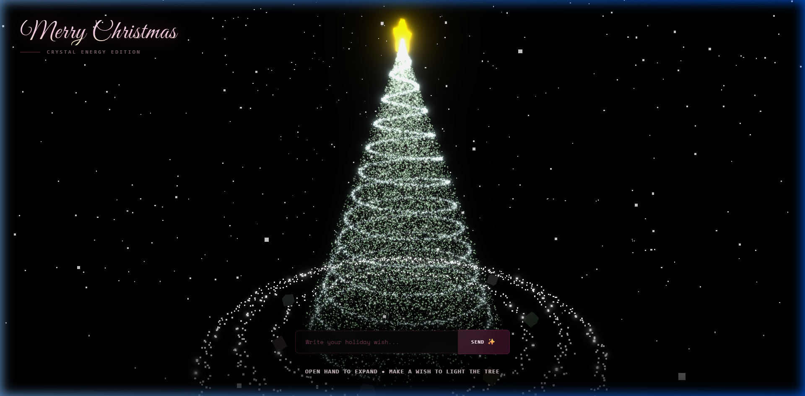
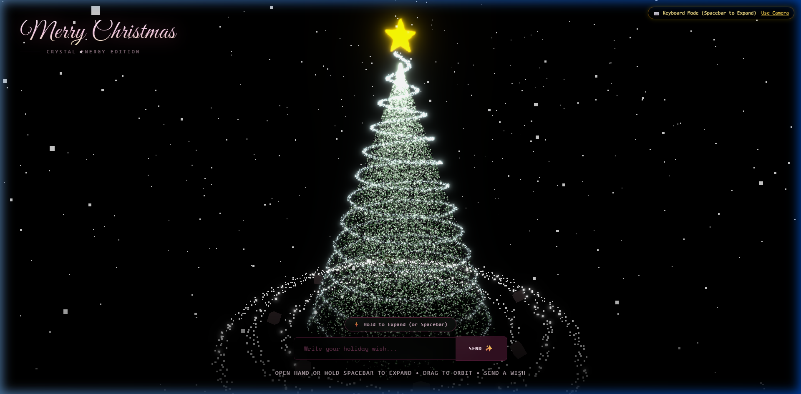
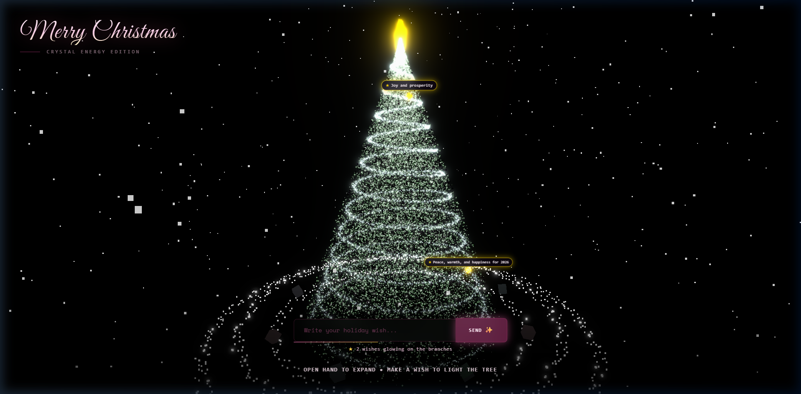

# 🎄 Merry Christmas • Pink Gold Crystal Energy Edition

<div align="center">



[](https://react.dev/)
[](https://threejs.org/)
[](https://r3f.docs.pmnd.rs/)
[](https://developers.google.com/mediapipe)
[](https://vitejs.dev/)
[](https://www.typescriptlang.org/)

<p align="center">
  <strong>An interactive, GPU-accelerated 3D Christmas experience featuring volumetric particle physics, AI-powered hand gesture tracking, a real-time shooting-star wish system with floating 3D text, and cinematic post-processing bloom.</strong>
</p>

</div>

---

## ✨ Features

### 🌟 Volumetric 3D Particle Tree
- **30,000+ individual particles** rendered via custom GLSL shaders.
- **Harmonious Pink & Gold Energy palette**: Radiant core, emerald-to-rose outer glow, and crystalline shimmer.
- **Organic Breathing Animation**: Gentle sine-wave pulsation that brings the tree to life.
- **Energy Unleash State**: Dynamically expands and scatters particles outward by up to 300% on command.

### 🌠 Interactive 3D Wish System
- **Real-Time Shooting Stars**: Type a wish into the glassmorphic input to launch a vibrant pink-gold particle comet.
- **Flying 3D Text**: The wish message travels across the screen alongside the comet in 3D space.
- **Branch Landing Physics**: Rather than stacking on a single point, wishes land organically along the tree's conical branches, accounting for active tree rotation.
- **Permanent Crystal Ornaments**: When a wish impacts a branch, it triggers a golden burst and becomes a multi-faceted glowing crystal star ornament.
- **3D Floating Text Badges**: Landed wishes feature interactive 3D billboarded text badges with gentle floating bob animations. Recent wishes display their full message, while older wishes display a compact badge that expands on hover.
- **Live Wish Counter**: Displays the number of active wishes currently lighting the tree.

### 🖐️ AI Hand Gesture Tracking (Google MediaPipe)
- **Computer Vision in the Browser**: Powered by `@mediapipe/tasks-vision` and WebAssembly.
- **Open Hand vs. Fist Gesture**: Opening your hand expands the tree into the "Unleashed Energy" state; closing your hand contracts it.
- **Magnetic Index Finger Steering**: Point with your index finger to magnetically rotate the tree in 3D space.

### ⌨️ Full Mouse & Keyboard Fallback Controls
- **No Webcam Needed**: Perfect for users on devices without cameras or with permissions disabled.
- **Hold Spacebar**: Press and hold **Spacebar** anywhere on the page to unleash the tree explosion (smart input guards prevent triggering while typing spaces in the wish box).
- **On-Screen Energy Button**: Click & hold the **"⚡ Hold to Expand"** button in the footer for both mouse and mobile touch users.
- **360° OrbitControls**: Click and drag to orbit smoothly around the tree, scroll to zoom in/out.
- **One-Click Mode Switcher**: Toggle between `📷 Hand Tracking` and `⌨️ Keyboard Mode` in the top-right corner.

### ⚡ 100% GPU Shader Acceleration
- **Zero CPU Vertex Bottlenecks**: Particle morphing and explosion states in `PinkTreeParticles`, `SpiralHelix`, and `TopDecoration` are computed entirely within GPU vertex shaders (`glsl mix()`).
- **Zero Heap Allocations in Render Loop**: Eliminates garbage collection stutters for smooth 60–120 FPS performance.

### 🎨 Cinematic Post-Processing & Atmosphere
- **Dual Rotating Base Energy Rings**: Spiraling silver-white particle rings orbiting the base.
- **Floating 3D Gift Boxes**: Metallic pastel gift boxes bobbing and tumbling around the tree.
- **Golden 5-Pointed Star Topper**: 1,500 particles forming a solid volumetric star rotating with a gentle pulse.
- **Atmospheric Snow**: Drifting snow particles with individual fall velocities.
- **Post-Processing Pipeline**: Bloom pass combined with ACES Filmic Tone Mapping for glowing highlights.

---

## 📸 Screenshots & Showcase

| Hero Tree Scene | Energy Explosion (GPU Shader) |
| :---: | :---: |
|  |  |

| Landed Wishes & 3D Floating Badges | Interactive Orbit View |
| :---: | :---: |
|  |  |

> 🎬 **Demo Recording**: A full video preview of the user journey and interactions is available in [`docs/demo-video.webp`](docs/demo-video.webp).

---

## 🕹️ Interactive Controls Reference

| Control | Action | Description |
| :--- | :--- | :--- |
| 🖐️ **Open Hand** | Camera Gesture | Unleashes and expands the tree particles by 300%. |
| ✊ **Closed Fist** | Camera Gesture | Contracts the tree back to its resting crystalline form. |
| ☝️ **Index Finger** | Camera Gesture | Magnetically steers the rotation of the tree. |
| ⌨️ **Hold Spacebar** | Keyboard Fallback | Expands the tree energy (ignored when typing in the wish input). |
| 🖱️ **Hold Energy Button** | Mouse / Touch | Click & hold **"⚡ Hold to Expand"** in the footer to unleash. |
| 🔄 **Click & Drag** | Mouse Orbit | Rotate 360° around the tree to inspect branches and wishes. |
| 🔍 **Mouse Wheel / Pinch** | Zoom | Zoom in for close-up views of ornaments or out for full-scene view. |
| ✨ **Send a Wish** | UI Input | Type your message and click **Send** or press **Enter**. |
| 🏷️ **Hover on Wish** | Mouse Interaction | Expands older wish badges to display the full message. |
| 🔁 **Switch to Keys / Camera**| Top-Right Badge | Toggle between webcam tracking and keyboard controls. |

---

## 🏗️ Architecture & Component Overview

```
Christmas/
├── App.tsx                        # Main application layout, overlay UI & footer controls
├── constants.ts                   # Scene configuration, color palette & dimensions
├── index.html                     # HTML5 entry, Google Fonts & root styles
├── index.tsx                      # React root mount
├── vite.config.ts                 # Vite bundler configuration
│
├── context/
│   ├── HandControlContext.tsx     # Global hand detection, keyboard listeners & unleash state
│   └── WishControlContext.tsx     # Wish storage, branch trajectory & landing registration
│
├── components/
│   ├── PinkParticleTreeScene.tsx  # Main Three.js Canvas, ContextBridge & Camera
│   ├── PinkTreeParticles.tsx      # Volumetric 30k particle tree (GLSL vertex/fragment)
│   ├── TopDecoration.tsx          # 5-pointed golden star topper (GPU vertex morph)
│   ├── SpiralHelix.tsx            # Tight hugging spiral energy ribbon (GPU vertex morph)
│   ├── WishSystem.tsx             # Shooting star comet, trail physics & flying 3D text
│   ├── LandedWishes.tsx           # Multi-faceted crystal ornaments & floating 3D badges
│   ├── HandTracker.tsx            # MediaPipe camera tracker, fallback indicator & toggle
│   ├── BaseRings.tsx              # Double-banded orbiting particle rings
│   ├── FloatingGifts.tsx          # Instanced 3D tumbling gift boxes
│   ├── SnowParticles.tsx          # Ambient drifting snow system
│   └── SceneEffects.tsx           # EffectComposer Bloom pass & ACES tone mapping
│
└── docs/                          # Demo screenshots and recording media
```

---

## 🚀 Getting Started

### Prerequisites
- [Node.js](https://nodejs.org/) (version 18 or newer recommended, tested on v23)
- npm (version 9 or newer)
- A modern WebGL2-compatible browser (Chrome, Edge, Firefox, or Safari)

### 1. Installation
Clone the repository and install dependencies:
```bash
git clone https://github.com/Nazarick0912/Christmas.git
cd Christmas
npm install
```

### 2. Run the Development Server
```bash
npm run dev
```
Open **`http://localhost:3000`** in your browser.

### 3. Build for Production
To generate an optimized production bundle:
```bash
npm run build
```
Preview the production build locally:
```bash
npm run preview
```

---

## 🛠️ Built With

- **[React 19](https://react.dev/)** - Modern UI components & state management
- **[Three.js](https://threejs.org/)** - 3D scene graphing and WebGL rendering engine
- **[@react-three/fiber](https://r3f.docs.pmnd.rs/)** - Declarative Three.js wrapper for React
- **[@react-three/drei](https://github.com/pmndrs/drei)** - Helpful helpers (Html, OrbitControls, ContextBridge)
- **[@react-three/postprocessing](https://github.com/pmndrs/react-postprocessing)** - GPU Bloom & cinematic filters
- **[@mediapipe/tasks-vision](https://developers.google.com/mediapipe/solutions/vision/hand_landmarker)** - On-device AI hand landmark detection
- **[Vite](https://vitejs.dev/)** - Lightning-fast frontend build tool
- **[TailwindCSS](https://tailwindcss.com/)** - Glassmorphism UI styling
- **[TypeScript](https://www.typescriptlang.org/)** - Type-safe developer experience

---

## 📄 License

This project is open source and available under the [MIT License](LICENSE).
